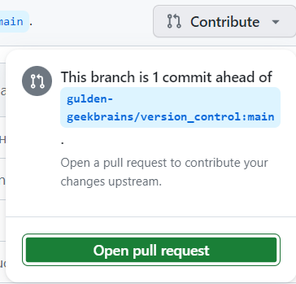

# Что такое GIT и с чем его едят
## Что это?
**Git** — это набор консольных утилит, которые отслеживают и фиксируют изменения в файлах.

Изначально Git был создан **Линусом Торвальдсом** при разработке ядра **Linux**. Однако инструмент так понравился разработчикам, что в последствии, он получил широкое распространение и его стали использовать в других проектах. С его помощью вы можете сравнивать, анализировать, редактировать, сливать изменения и возвращаться назад к последнему сохранению. Этот процесс называется контролем версий.

## Зачем это?
* Ну **во-первых**, чтобы отследить изменения, произошедшие с проектом, со временем. Проще говоря, мы можем посмотреть как менялись файлы программы, на всех этапах разработки и при необходимости вернуться назад и что-то отредактировать. Часто бывают ситуации, когда, во вполне себе работающий код, вам нужно внести определенные правки или улучшить какой-то функционал, по желанию заказчика. Однако после внедрения нововведений, вы с ужасом понимаете, что все сломалось. У вас начинается судорожно дергаться глаз, а в воздухе повисает немой вопрос: “Что делать?” Без системы контроля версий, вам надо было бы долго напряженно просматривать код, чтобы понять как было до того, как все перестало работать. С Гитом же, все что нужно сделать - это откатиться на коммит назад.

* **Во-вторых** он чрезвычайно полезен при одновременной работе нескольких специалистов, над одним проектом. Без Гита случится коллапс, когда разработчики, скопировав весь код из главной папки и сделав с ним задуманное, попытаются одновременно вернуть весь код обратно.

## Установка
**Установить git на свою машину очень просто:**
* **Linux** — нужно просто открыть терминал и установить приложение при помощи пакетного менеджера вашего дистрибутива. Для Ubuntu команда будет выглядеть следующим образом:
```ch
sudo apt-get install git
```

* **Windows** — git for windows содержит и клиент с графическим интерфейсом, и эмулятор bash,
[скачать тут](https://git-scm.com/download/win)

* **OS X** — проще всего воспользоваться homebrew. После его установки запустите в терминале:
```ch
brew install git
```
## Настройка
Для начала необходимо представиться.

Откройте **терминал** и запустите команды:
```ch
git config --global user.name "My Name"
git config --global user.email myEmail@example.com
```
Теперь каждое наше действие будет отмечено именем и почтой. Таким образом, пользователи всегда будут в курсе, кто отвечает за какие изменения — это вносит порядок.

>Git хранит весь пакет конфигураций в файле .gitconfig, находящемся в вашем локальном каталоге. Чтобы сделать эти настройки глобальными, то есть применимыми ко всем проектам, необходимо добавить флаг –global.

Для того, чтобы посмотреть все настройки системы, используйте команду:
```ch
git config --list
```

Если вы не до конца настроили систему для работы, в начале своего пути - не беда. Git всегда подскажет разработчику, если тот запутался, например:

* Команда git --help - выводит общую документацию по git
* Если введем git log --help - он предоставит нам документацию по какой-то определенной команде (в данном случае это - log)
* Если вы вдруг сделали опечатку - система подскажет вам нужную команду
* После выполнения любой команды - отчитается о том, что вы натворили
* Также Гит прогнозирует дальнейшие варианты развития событий и всегда направит разработчика, не знающего, куда двигаться дальше

## Создание нового репозитория

**Git** хранит свои файлы и историю прямо в папке проекта. Чтобы создать новый **репозиторий**, нам нужно открыть терминал, зайти в папку нашего проекта и выполнить команду init. Это включит приложение в этой конкретной папке и создаст скрытую директорию .git, где будет храниться история репозитория и настройки.
Создайте на рабочем столе папку под названием git_instruction. Для этого в окне терминала введите:
```ch
cd C:\Users\user\Desktop\git_instruction
git init
```
Команда **cd** меняет директорию в командной строке на указанную (cd - Change Directory).

**git init** инициализирует репозиторий.

Командная строка должна вернуть что-то вроде:
```ch
Initialized empty Git repository in C:\Users\user\Desktop\git_instruction\.git\
```

Это значит, что **репозиторий** был успешно создан, но пока что пуст.

## Проект в Visual Studio Code
**Visual Studio Code** можно скачать по [ссылке](https://code.visualstudio.com)

Нужно открыть нашу созданную папку git_instruction.
Для этого зайти в меню **File** и выбрать **Open Folder...**


Далее создать новый файл с помощью кнопки:


Разрешение у файла поставим **.md** (**MarkDown**).


>**Markdown** — облегчённый язык разметки, созданный с целью обозначения форматирования в простом тексте, с максимальным сохранением его читаемости человеком, и пригодный для машинного преобразования в языки для продвинутых публикаций (HTML, Rich Text и других).

Про синтаксис MarkDown можно подробнее прочитать [тут](https://stifell.github.io/ru/post/markdown/)

## Определение состояния
**status** — это еще одна важнейшая команда, которая показывает информацию о текущем состоянии репозитория: актуальна ли информация на нём, нет ли чего-то нового, что поменялось, и так далее. Запуск git status на нашем свежесозданном репозитории должен выдать:
```ch
On branch master
Initial commit
Untracked files:
(use "git add ..." to include in what will be committed)
```

Сообщение говорит о том, что есть неотслеживаемый файл (в нашем случае **instruction.md**). Это значит, что файл новый и система еще не знает, нужно ли следить за изменениями в файле или его можно просто игнорировать. Для того, чтобы начать отслеживать новый файл, нужно его специальным образом объявить.

В git есть концепция области подготовленных файлов. Можно представить ее как холст, на который наносят изменения, которые нужны в коммите. Сперва он пустой, но затем мы добавляем на него файлы (или части файлов, или даже одиночные строчки) командой add и, наконец, коммитим все нужное в репозиторий (создаем слепок нужного нам состояния) командой commit.
В нашем случае у нас только один файл, так что добавим его:

```ch
git add instruction.md
```
Если нам нужно добавить все, что находится в директории, мы можем использовать
```ch
git add -A
```
>Конечно добавлять всё сразу удобнее, чем прописывать каждую позицию отдельно. Однако, тут надо быть внимательным, чтобы не добавить по ошибке ненужные элементы.

Проверим статус снова, на этот раз мы должны получить другой ответ:
```ch
On branch master
Initial commit
Changes to be committed:
(use "git rm --cached ..." to unstage)
new file: instruction.md
```

Файл готов к коммиту. Сообщение о состоянии также говорит нам о том, какие изменения относительно файла были проведены в области подготовки — в данном случае это новый файл, но файлы могут быть модифицированы или удалены.

Для коммита нужно вызвать команду:
```ch
git commit -m 'Комментарий'
```

Флажок -m задаст commit message - комментарий разработчика. Он необходим для описания закоммиченных изменений. И здесь работает золотое правило всех комментариев в коде: «Максимально ясно, просто и содержательно обозначь написанное!»

>Прописывать комментарий необходимо, чтобы другие пользователи понимали, какие изменения были внесены.

## Как посмотреть коммиты
Для просмотра все выполненных фиксаций можно воспользоваться историей коммитов. Она содержит сведения о каждом проведенном коммите проекта. Запросить ее можно при помощи команды:
```ch
git log
```

Для примера, информация будет в таком виде:


>Как вы можете заметить, идентификаторы довольно длинные, но для работы с ними не обязательно копировать их целиком — первых нескольких символов будет вполне достаточно.

## Переход к коммитам
Гит позволяет вернуть выбранный файл к состоянию на момент определенного коммита. Это делается командой **checkout**.

```ch
git checkout 'идентификатор' instruction.md
```

## Работа с удалёнными репозиториями

Для того, чтобы внести вклад в какой-либо Git-проект, вам необходимо уметь работать с удалёнными репозиториями. Удалённые репозитории представляют собой версии вашего проекта, сохранённые в интернете или ещё где-то в сети. У вас может быть несколько удалённых репозиториев, каждый из которых может быть доступен для чтения или для чтения-записи. Взаимодействие с другими пользователями предполагает управление удалёнными репозиториями, а также отправку и получение данных из них.

Одним из самых популярных сервисов для работы с удаленными репозиториями является [https://github.com]()

### Копирование репозитория с github.com на компьютер
На сайте нужно найти готовый репозиторий.

Далее нажать на **Code** --> **Скопировать** (справа от ссылки)


В терминале выполнить команду 
```ch
git clone <скопированная ссылка>
```

После этого на компьютере появится папка-копия данного репозитория в указанной в терминале директории (напр. какая-нибудь папка на рабочем столе).

Однко данная директория не будет являться репозиторием сама по себе (при вызове команды git status будет выведено сообщение not a git repository). 

Нам нужно перейти в саму скопированную папку-репозиторий с помощью команды

```ch
cd <имя папки>
```

### Копирование репозитория с компьютера на github.com
Для загрузки репозитория с компьютера, нужно зарегистрироваться на github.com.

После этого войти в свой аккаунт, нажать на **"+"** в правом верхнем углу и **New repository**:


Задать имя репозитория:


Настройки приватности:


Далее нажать **Create Repository**


Git предлагает три варианта:


В данном случае нам подходит второй вариант. Нужно скопировать указанные команды и последовательно выполнить их в командной строке.
При первой попытке **"запушить"** репозиторий необходимо будет пройти авторизацию, следуя подсказкам в командной строке.

### Внесение изменений в удаленные и локальные репозитории
После внемения изменений в локальный репозиторий (находящийся на компьютере), появляется необходимость также внести эти изменения и в удаленный репозиторий.

Для начала все изменения нужно добавить (git add) и коммитнуть (git commit -m "...") все изменения.

После этого можно просто вызвать команду

```ch
git push
``` 
Она продублирует изменения из локального репозитория в привязанный к нему удаленный репозиторий.

Можно применить изменения и в обратную сторону - из удаленного репозитория в локальный.

Для этого точно так же - все изменения должны быть коммитнуты.

После этого в локальном репозитории нужно выполнить команду

```ch
git pull
```

Нужно обратить внимание на то, что git pull - составная команда. Она не только скопирует изменения, но и также попытается "смержить" все имеющиеся ветки.

### Предложение изменений в чужие проекты **(pull request)**
На github.com нужно найти репозиторий, в который нужно предложить изменения.

Сразу внести изменения в него нельзя, сначала их должен одобрить владелец репозитория.

Для предложения изменений нужно создать копию репозитория на своем аккаунте.

В правом верхнем углу нужно нажать на кнопку **Fork**:


На аккаунте появится копия репозитория, но с пометкой:

**forked from <имя аккаунта-владельца\имя репозитория>**

Данный репозиторий нужно склонировать на компьютер командой git clone. 

Все предложения изменений в чей-то проект делаются в отдельной ветке, поэтому нужно ее создать, перейти в нее и вносить изменения в ней.

После внесени изменений в склонированный репозиторий и коммита изменений, нужно вызвать команду 
```ch
git push --set-upstream origin <имя ветки>
```
чтобы пропушить изменения в скопированный репозиторий на github.com.

После этого появится новая кнопка, на которую нужно нажать, чтобы отправить pull request (предложить изменения) владельцу оригинального репозитория:



Можно указать комментарий и нажать **Create pull request**


